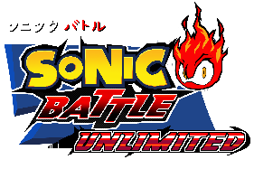

# Sonic Battle Unlimited

*Sonic Battle Unlimited* is a 3D Sonic the Hedgehog fighting fan game, heavily
inspired by *Sonic Battle* on the Game Boy Advance.

*Sonic Battle Unlimited* is scheduled for release at the Sonic Amateur Games
Expo (SAGE) 2024.

## To-Do List

The [To-Do List](https://github.com/Sonic-Battle-Unlimited/Sonic-Battle-Unlimited/blob/main/Sonic%20Battle%20Prototype/To%20Do%20List.txt)
is available in the Sonic Battle Prototype directory.

## Controls

### Keyboard

- **W**/**A**/**S**/**D**: Move the character around.
- **Space**: Perform a jump or dash attack.
- **Ctrl**: Assume a guarding position, or heal if held down.
- **Enter**: Perform a normal attack.
- **E** or **Up Arrow**: Perform an upper attack.
- **Shift**: Perform a special attack. The specific attack is determined by
what you picked at the start of the match and whether you're on the ground or
airborne.
- **Tab**: Flip the camera position.

### Gamepad (Xbox One)

- **Left Stick**: Move the character around.
- **A**: Perform a jump or dash attack.
- **LB**: Assume a guarding position, or heal if held down.
- **B**: Perform a normal attack.
- **Y**: Perform an upper attack.
- **X**: Perform a special attack. The specific attack is determined by
what you picked at the start of the match and whether you're on the ground or
airborne.
- **RS Click**: Flip the camera position.
